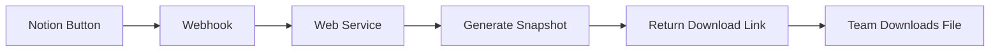

# Notion Button Integration - Project Snapshot Generator

## Overview

This guide explains how to create a Notion button that generates a comprehensive markdown snapshot of your entire project, perfect for AI analysis and strategic planning.

## How It Works



## Option 1: GitHub Actions (Recommended)

### Pros
- Free with GitHub
- Integrates with your repository
- Automatic artifact storage
- No external services needed

### Setup Steps

1. **Push Repository to GitHub**
```bash
git init
git add .
git commit -m "Initial commit"
git remote add origin https://github.com/YOUR_USERNAME/santas-workshop.git
git push -u origin main
```

2. **Create GitHub Action Workflow**
Create `.github/workflows/generate-snapshot.yml`:

```yaml
name: Generate Project Snapshot

on:
  workflow_dispatch:  # Manual trigger
  repository_dispatch:  # Webhook trigger
    types: [generate-snapshot]

jobs:
  generate:
    runs-on: ubuntu-latest

    steps:
    - uses: actions/checkout@v3

    - name: Setup Python
      uses: actions/setup-python@v4
      with:
        python-version: '3.10'

    - name: Install dependencies
      run: |
        pip install python-dotenv requests

    - name: Generate Snapshot
      env:
        NOTION_API: ${{ secrets.NOTION_API }}
      run: |
        python scripts/compile_project_snapshot.py

    - name: Upload Snapshot
      uses: actions/upload-artifact@v3
      with:
        name: project-snapshot
        path: snapshots/*.md
        retention-days: 30

    - name: Create Download URL
      run: |
        echo "Download your snapshot from the Actions tab"
        echo "Direct link: ${{ github.server_url }}/${{ github.repository }}/actions/runs/${{ github.run_id }}"
```

3. **Add GitHub Secret**
- Go to Settings → Secrets → Actions
- Add `NOTION_API` with your Notion API key

4. **Create GitHub Webhook Token**
- Go to Settings → Developer settings → Personal access tokens
- Generate token with `repo` and `workflow` permissions
- Save this token

5. **Set Up Notion Button**
- In your Notion database or page
- Add a Button property or Button block
- Click "Add action" → "Send webhook"
- URL: `https://api.github.com/repos/YOUR_USERNAME/santas-workshop/dispatches`
- Headers:
  ```json
  {
    "Accept": "application/vnd.github.v3+json",
    "Authorization": "token YOUR_GITHUB_TOKEN",
    "Content-Type": "application/json"
  }
  ```
- Body:
  ```json
  {
    "event_type": "generate-snapshot"
  }
  ```

## Option 2: Vercel Edge Function (Easiest)

### Pros
- Free hosting
- Simple deployment
- Instant response
- No GitHub required

### Setup Steps

1. **Create Vercel Function**
Create `api/generate-snapshot.js`:

```javascript
const { exec } = require('child_process');
const fs = require('fs').promises;
const path = require('path');

export default async function handler(req, res) {
  // Only allow POST
  if (req.method !== 'POST') {
    return res.status(405).json({ error: 'Method not allowed' });
  }

  try {
    // Run the Python script
    await new Promise((resolve, reject) => {
      exec('python scripts/compile_project_snapshot.py --no-pull',
        (error, stdout, stderr) => {
          if (error) reject(error);
          else resolve(stdout);
        }
      );
    });

    // Find the latest snapshot
    const snapshotsDir = path.join(process.cwd(), 'snapshots');
    const files = await fs.readdir(snapshotsDir);
    const latest = files.sort().reverse()[0];

    // Read and return the file
    const content = await fs.readFile(
      path.join(snapshotsDir, latest),
      'utf-8'
    );

    // Return as downloadable file
    res.setHeader('Content-Type', 'text/markdown');
    res.setHeader('Content-Disposition',
      `attachment; filename="${latest}"`);
    res.status(200).send(content);

  } catch (error) {
    res.status(500).json({
      error: 'Failed to generate snapshot',
      details: error.message
    });
  }
}
```

2. **Deploy to Vercel**
```bash
npm init -y
npm install -g vercel
vercel
```

3. **Configure Notion Button**
- URL: `https://your-app.vercel.app/api/generate-snapshot`
- No headers needed
- Empty body or `{}`

## Option 3: Simple Flask Server (Local Network)

### Pros
- Runs on local network
- Full control
- No external dependencies

### Setup Steps

1. **Create Flask App**
Create `web_service.py`:

```python
from flask import Flask, send_file, jsonify
from flask_cors import CORS
import subprocess
from pathlib import Path
import os

app = Flask(__name__)
CORS(app)  # Allow cross-origin requests

@app.route('/generate-snapshot', methods=['POST'])
def generate_snapshot():
    try:
        # Run the snapshot script
        result = subprocess.run(
            ['python', 'scripts/compile_project_snapshot.py'],
            capture_output=True,
            text=True,
            cwd=Path(__file__).parent
        )

        if result.returncode != 0:
            return jsonify({'error': result.stderr}), 500

        # Find the latest snapshot
        snapshots_dir = Path(__file__).parent / 'snapshots'
        files = sorted(snapshots_dir.glob('*.md'),
                      key=lambda x: x.stat().st_mtime)

        if not files:
            return jsonify({'error': 'No snapshot generated'}), 500

        latest_file = files[-1]

        # Return file as download
        return send_file(
            latest_file,
            as_attachment=True,
            download_name=latest_file.name,
            mimetype='text/markdown'
        )

    except Exception as e:
        return jsonify({'error': str(e)}), 500

@app.route('/health', methods=['GET'])
def health():
    return jsonify({'status': 'healthy'})

if __name__ == '__main__':
    # Run on all network interfaces
    app.run(host='0.0.0.0', port=5000)
```

2. **Install Dependencies**
```bash
pip install flask flask-cors
```

3. **Run Server**
```bash
python web_service.py
```

4. **Configure Notion Button**
- URL: `http://YOUR_LOCAL_IP:5000/generate-snapshot`
- Note: Team members must be on same network

## Option 4: AWS Lambda (Scalable)

### Setup with Serverless Framework

1. **Create serverless.yml**
```yaml
service: notion-snapshot

provider:
  name: aws
  runtime: python3.9
  region: us-west-2

functions:
  generateSnapshot:
    handler: handler.generate
    events:
      - http:
          path: snapshot
          method: post
          cors: true
    environment:
      NOTION_API: ${env:NOTION_API}

plugins:
  - serverless-python-requirements
```

2. **Deploy**
```bash
npm install -g serverless
serverless deploy
```

## Making the Button User-Friendly

### Option A: Direct Download Link
Modify the script to upload to a cloud service and return a download link:

```python
# Add to compile_project_snapshot.py
def upload_to_cloud(filepath):
    """Upload to S3, Google Drive, or Dropbox"""
    # Implementation depends on chosen service
    # Return public download URL
    pass
```

### Option B: Email Delivery
Send the snapshot via email:

```python
import smtplib
from email.mime.text import MIMEText
from email.mime.multipart import MIMEMultipart
from email.mime.application import MIMEApplication

def email_snapshot(filepath, recipient):
    """Email the snapshot to recipient"""
    msg = MIMEMultipart()
    msg['Subject'] = 'Project Snapshot'
    msg['From'] = 'noreply@santasworkshop.com'
    msg['To'] = recipient

    # Attach file
    with open(filepath, 'rb') as f:
        attach = MIMEApplication(f.read(), _subtype="md")
        attach.add_header('Content-Disposition',
                         'attachment',
                         filename=os.path.basename(filepath))
        msg.attach(attach)

    # Send
    smtp = smtplib.SMTP('smtp.gmail.com', 587)
    smtp.starttls()
    smtp.login('your_email', 'your_password')
    smtp.send_message(msg)
    smtp.quit()
```

## Security Considerations

1. **API Key Protection**
   - Never commit API keys to repository
   - Use environment variables or secrets management
   - Rotate keys regularly

2. **Access Control**
   - Add authentication to webhook endpoints
   - Use webhook signatures for verification
   - Limit IP addresses if possible

3. **Rate Limiting**
   - Implement rate limiting to prevent abuse
   - Cache recent snapshots to reduce load

## Testing Your Integration

1. **Test Webhook Locally**
```bash
curl -X POST http://localhost:5000/generate-snapshot \
  -H "Content-Type: application/json" \
  -d '{}'
```

2. **Test from Notion**
- Create test button
- Click and verify snapshot generation
- Check download/delivery method

## Troubleshooting

### Common Issues

1. **"Webhook failed"**
   - Check URL is accessible
   - Verify headers and authentication
   - Check server logs

2. **"No snapshot generated"**
   - Ensure Python script works locally
   - Check file permissions
   - Verify environment variables

3. **"Download failed"**
   - Check file path is correct
   - Ensure proper MIME type
   - Verify file size limits

## Quick Start Recommendation

For fastest setup:
1. Use **Option 3** (Flask) for immediate testing
2. Migrate to **Option 1** (GitHub Actions) for production
3. Consider **Option 2** (Vercel) for simplest deployment

## Next Steps

1. Choose your deployment method
2. Set up the web service
3. Configure Notion button
4. Test with team
5. Document for team members

---

*With this setup, any team member can generate a comprehensive project snapshot with one click, ready for AI analysis and strategic planning.*